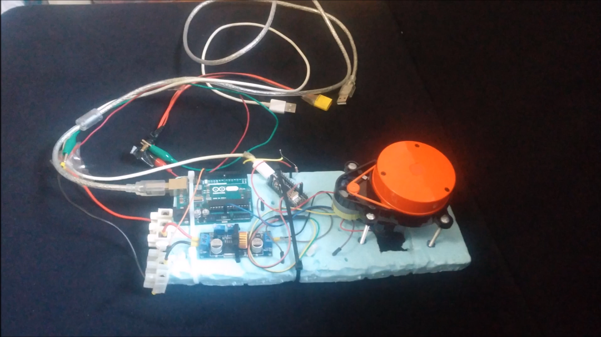
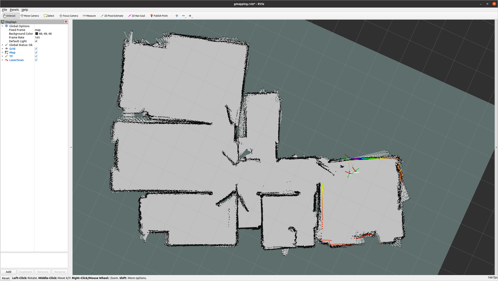

# xiaomi_lds_myhome

## Introduction

I have experimented SLAM in my home with a spare part of Xiaomi Mi robot (first version) years ago. Back in those days there were no cheaper alternatives to LiDAR sensors (like RPLIDAR, etc.) so I have developed my own driver for this task. There are two different examples can be run via launch files; GMapping and AMCL using the recorded bag file for SLAM and localization tasks. 

**Note:** Unfortunately I can't release the source code for the driver but nowadays it should be easy to find it on GitHub. Good luck!

## Dependencies

Dependencies: Ubuntu 20.04 + ROS Noetic

```bash
$ cd catkin_ws/src
$ git clone https://github.com/salihmarangoz/xiaomi_lds_myhome.git
$ cd ..
$ rosdep install --from-paths src --ignore-src -r
$ catkin build
```

## Running

```bash
$ source devel/setup.bash
$ roslaunch xiaomi_lds_myhome gmapping_demo.launch
# or
$ roslaunch xiaomi_lds_myhome amcl_demo.launch
```

## Experiment

Well, I didn't have an extra voltage regulator for the motors so I used an Arduino Mini for it. Other regulator is used for powering up the electronic components of LiDAR sensor and the communication via computer done over USB serial port.





